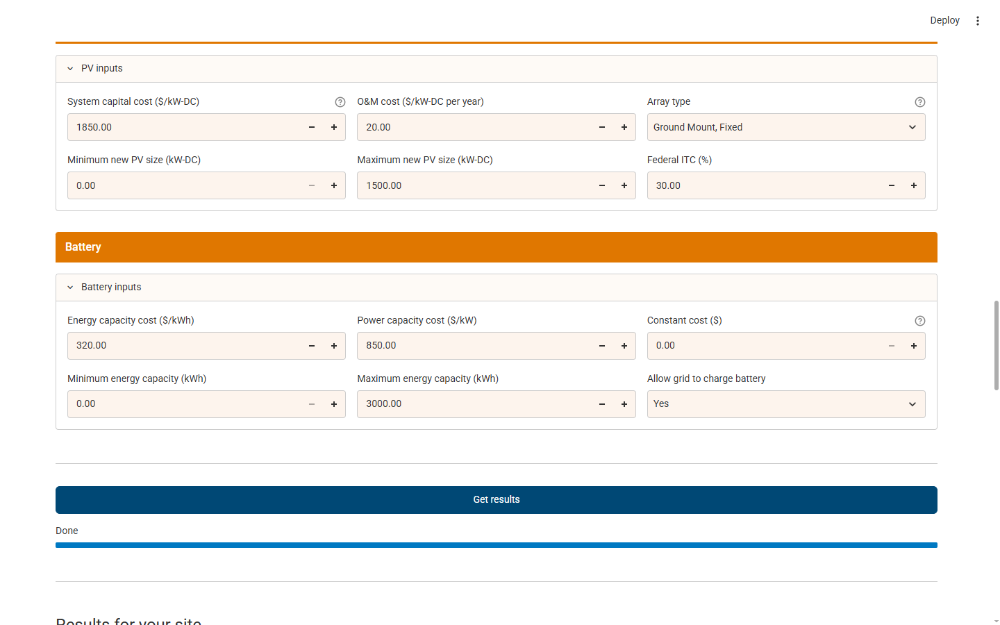

# GreenHouseV2 — REopt replication, validation and field use

One document covering the whole project: what was built, how it was verified against
the live REopt web tool and the REopt.jl source, what was found in both, and where
the limits are.

**Target system:** <https://reopt.nlr.gov/tool> · **Local engine:** `REopt/` — REopt.jl
**v0.61.1** (`REopt/Project.toml`) · **Our calculator:** `calculator/` (Python + Streamlit
+ PuLP/HiGHS) · **Offline docs:** `docs/reopt-jl/` (14 pages, 197 KB)

---

## Contents

- [Part 1 — The calculator](#part-1--the-calculator)
- [Part 2 — Validation scoreboard](#part-2--validation-scoreboard)
- [Part 3 — Test cases in detail](#part-3--test-cases-in-detail)
- [Part 4 — Findings about the REopt web tool](#part-4--findings-about-the-reopt-web-tool)
- [Part 5 — Grid-tied vs off-grid](#part-5--grid-tied-vs-off-grid)
- [Part 6 — CHP and Prime Generator](#part-6--chp-and-prime-generator)
- [Part 7 — Off-grid CHP](#part-7--off-grid-chp)
- [Part 8 — Field use: the Sana'a vendor proposal](#part-8--field-use-the-sanaa-vendor-proposal)
- [Part 9 — Bugs found and fixed](#part-9--bugs-found-and-fixed)
- [Part 10 — Known gaps](#part-10--known-gaps)
- [Part 11 — Repository layout and how to reproduce](#part-11--repository-layout-and-how-to-reproduce)

---

# Part 1 — The calculator

A working subset of the REopt web tool: **steps 1–5**, four technologies
(Prime Generator / Generator, CHP, PV, Battery).

```bash
pip install streamlit pulp highspy pandas altair
streamlit run calculator/streamlit_app.py
```

Needs a free API key from <https://developer.nlr.gov> for PVWatts and URDB:
set `NLR_DEVELOPER_API_KEY`, or put the key in `.nrel_api_key`.

## Nothing in it is invented

| Piece | Source |
|---|---|
| Step titles, field labels, option values **and order**, defaults, help text | Scraped live from the tool into `reopt_test_data/ui-spec.json`, then **code-generated** into `reopt_core/ui_fields.py` (270 fields) |
| `annuity`, `annuity_two_escalation_rates` | `utils.jl:11,21` |
| `levelization_factor` · `npv` | `utils.jl:54` · `utils.jl:295` |
| `effective_cost` (ITC + MACRS → `cap_cost_slope`) | `utils.jl:83` |
| MACRS 5/7-year schedules | `financial.jl:19-20` |
| Objective — lifecycle cost, per-term tax treatment | `reopt.jl:511-590` |
| Storage sizing / SOC dynamics / cost-constant binary | `storage_constraints.jl:2-73,151` |
| Electric load balance | `load_balance.jl:3` |
| PV land-use constraint | `tech_constraints.jl:26-31` |
| Operating reserve (off-grid) | `operating_reserve_constraints.jl` |
| Thermal balance + existing boiler | `chp.jl`, `existing_boiler.jl`, `financial.jl:7` |
| Nearest CRB city | `doe_commercial_reference_building_loads.jl:79-93` |
| Procedural FlatLoad shapes | `doe_commercial_reference_building_loads.jl:278` |
| Hourly load shapes | `REopt/data/load_profiles/electric/crb8760_norm_<City>_<Type>.dat` |
| Heating load | `REopt/data/load_profiles/{space_heating,domestic_hot_water}_annual_mmbtu.json` |
| PV production | PVWatts v8 — same URL and `ac/1000` scaling as `utils.jl:475-513` |
| Tech defaults | `pv.jl`, `electric_storage.jl:225-265`, `generator.jl:9-47`, `chp_defaults.json` |
| Emissions | Cambium `scenarioviewer.nlr.gov`, AVERT `/tool/emissions-profile`, EASIUR `/tool/emissions-health-defaults` |
| Solver | **HiGHS** — the same solver the web tool submits (`solver_name: "HiGHS"`) |

UI rules reproduced from observed behaviour:

- Prime Generator and CHP are **mutually exclusive** (verified in both directions).
- **Backup Generator only appears when Resilience is selected.**
- Off-grid removes the entire electricity-rate panel and has **no business-as-usual
  case** (`reopt.jl:117`).
- Required fields with a blank default stay blank — "Type of building" is not silently
  defaulted to the first option.

---

# Part 2 — Validation scoreboard

Every figure below comes from a real submission to the public REopt service, compared
row-by-row against the same scenario in our calculator.

| Suite | Scope | Result | Script |
|---|---|---|---|
| **TC1** | Golden CO · Large Office 5 GWh · PV + Battery · 25 yr | **21/21** | `tools/validate2.py` |
| **TC2** | Phoenix AZ · Supermarket 3 GWh · emissions, health & climate costs · 20 yr | **15/15** | `tools/validate_tc2.py` |
| **G1/G2** | CHP and Prime Generator + PV + Battery | **20/20** | `tools/validate_gen.py` |
| **V1–V4** | Variability — four sites, buildings, tariffs, horizons | **27/29** | `tools/vary_ours.py` |
| **OG1** | Off-grid, generator pinned as the tool submits it | **LCC −0.08%** | `tools/validate_offgrid.py` |
| **PT2** | Live head-to-head on a scenario neither had seen | **22/24** | `tools/validate_parity.py` |

The single most demanding check is the **business-as-usual bill**: it exercises the URDB
parse, the 8,760-hour CRB load, the TOU demand ratchets and the present-worth factor with
no optimizer freedom to absorb an error. It reproduces REopt **to the dollar** in TC1, TC2,
V1–V4 and PT2.

---

# Part 3 — Test cases in detail

## TC1 — Golden CO (21/21)

> Large Office 5,000,000 kWh · 5 acres · Intermountain REA B-TOU ·
> PV $1,600/kW max 2,000 · Battery $300/kWh $800/kW const $0 max 4,000 ·
> 25 yr · discount 8.3% · escalation 1.7%

| | REopt | Ours |
|---|---:|---:|
| PV | 165 kW | **165 kW** |
| Battery | 78 kW / 171 kWh | **78 kW / 171 kWh** |
| Life cycle cost, BAU / optimized | $4,624,883 / $4,601,676 | $4,624,883 / $4,601,707 |
| Net present value | $23,207 | $23,176 |
| CO₂e over the period | 18,664 t | 18,664 t |
| Cost of climate / health emissions | $600,023 / $427,092 | $600,195 / $427,108 |

## TC2 — Phoenix AZ (15/15)

Deliberately a different site, building, tariff, AVERT region and horizon.
REopt run `18d2e5c0-536f-4a07-8d8b-d2a24673b830`.

Both calculators decline to build anything (PV 0 / Battery 0). Year-1 energy $117,000,
demand $16,526, fixed $300, total $133,826 and life cycle cost $1,214,920 all match
exactly. Cambium location (*West Connect South*), AVERT region (*Southwest*), CO₂e
(423 t/yr) and NOx/SO₂/PM2.5 (0.46 / 0.21 / 0.07 t) all match.

## V1–V4 — Variability (27/29)

Four scenarios, each varying a different axis. AVERT region and Cambium location resolved
automatically from coordinates in all four and matched: Mid-Atlantic, Northwest, Florida,
Southwest.

| # | Scenario | What it probes | Result |
|---|---|---|---|
| **V1** | Chicago · Hospital · 8 GWh · **roof** 120,000 ft² · **net metering** · 30 yr | roof limit, NEM, long horizon | **6/6** |
| **V2** | Seattle · Warehouse · 1.5 GWh · **battery only** · 15 yr · 9% | no-PV path, short horizon, high discount | **7/7** |
| **V3** | Miami · Restaurant · 0.8 GWh · PV+battery · 1 acre · 20 yr | tiny site, cheap tariff, build-nothing | **8/8** |
| **V4** | Albuquerque · Midrise Apartment · 2.5 GWh · PV+battery · 4 acres · 25 yr | default costs, both techs built | **6/8** |

V1's PV hit the roof limit exactly in both: 120,000 ft² × 0.01 kW/ft² = 1,200 kW.
V3 is the one where Cambium returns *"NA – Cambium data not used"* (Florida Keys is
outside the Cambium grid) and both tools handled it correctly.

**V4 is the only disagreement**, and it is understood: PV 290 kW vs our 358 kW (+23%),
because the piecewise PV size-class cost curve is not ported. Battery capacity matched
to −0.07% and life cycle cost to **−0.16%** — the solutions sit on a nearly flat part of
the objective, so a different PV size costs almost the same.

## PT2 — Live head-to-head on an unseen scenario (22/24)

Run on 2026-08-24. REopt run
[`c5e511b2-56d6-4673-8a7a-f46338687576`](https://reopt.nlr.gov/tool/results/c5e511b2-56d6-4673-8a7a-f46338687576).

> Golden CO · **Supermarket** 3,000,000 kWh · 6 acres · B-TOU · **20 yr** · 7.5% discount ·
> 2.2% escalation · PV $1,850/kW max 1,500 · Battery $320/kWh $850/kW max 3,000 ·
> no export compensation. REopt solved at a **0.1%** optimality tolerance.

Nothing overlaps TC1/TC2/G1/G2: different building, load, costs, horizon, discount and land.

**Business as usual — all five rows to the dollar:**
energy $190,890 · demand $91,771 · fixed $480 · year-1 total $283,141 ·
life cycle cost $2,570,463.

**Optimized:**

| Row | REopt | Ours | Δ |
|---|---:|---:|---:|
| PV Size | 25 kW | 25 kW | +0.47% |
| Battery Power | 26 kW | 26 kW | −1.23% |
| Battery Capacity | 36 kWh | 35 kWh | −3.88% |
| Average Annual PV Energy Production | 36,747 kWh | 36,747 kWh | **0.00%** |
| Year 1 Utility Cost — Before Tax | $276,050 | $276,109 | +0.02% |
| Upfront Capital Before Incentives | $80,081 | $79,366 | −0.89% |
| **Total Life Cycle Costs** | **$2,559,868** | **$2,559,873** | **+0.000%** |
| Net Present Value | $10,595 | $10,590 | −0.05% |

Life cycle cost lands **$5 apart on $2.56 million**.

**The two mismatched rows are one difference, not two.** Battery charging totals 3,067 kWh
for REopt (443 from PV + 2,624 from grid) against 2,959 kWh for us (2,959 from PV + 0 from
grid) — 3.5% apart. Both charge the same 36 kWh battery by the same amount; they attribute
the source differently. In an hour where PV is generating and the battery is charging that
label is arbitrary, which is why every cost row still agrees.

**Through the UI, not just the engine** — same inputs typed into the running app:

| | REopt | Our engine | Our Streamlit UI |
|---|---:|---:|---:|
| PV size | 25 kW | 25 kW | **25 kW** |
| Battery power | 26 kW | 26 kW | **26 kW** |
| Battery capacity | 36 kWh | 35 kWh | **35 kWh** |
| Net savings | $10,595 | $10,590 | **$10,590** |



### A discarded first attempt

PT1 was Phoenix/Mesa on an Arizona Public Service TOU tariff
([`87129ce1`](https://reopt.nlr.gov/tool/results/87129ce1-bbcc-4265-8853-0e58aeb97a3e)).
It is not reported as a result because the tariff could not be reproduced: the web tool
submits the rate by **display name** and resolves it server-side, and the record it
resolved implies **$0.58/kWh** for energy ($1,739,600 on 3,000,000 kWh). All 55 APS
large-general-service records at those coordinates bill $0.11–0.13/kWh. The gap is in
tariff identification, not in either optimizer.

---

# Part 4 — Findings about the REopt web tool

## 4.1 Defects

### `GET /tool/utility-rates` returns HTTP 500 intermittently — *medium*

First address entry produced a blocking alert (*"An unexpected error occurred while
fetching the utility rates"*). The identical URL returned HTTP 200 on three consecutive
`curl` calls, and other coordinates returned 200. A genuine intermittent server fault,
not a bad request. A user's first attempt at a site can fail with an opaque alert and no
retry guidance.

### Outage start date/hour required by the backend, not enforced client-side — *high (UX)*

Submitting with the outage start blank passes client validation and fails server-side with
a raw Julia dictionary:

```
{"ElectricUtility" => {"outage_start_time_steps" => ["Item 1 in the array did not validate: This field cannot be null."]}}
```

Step 0 guidance lists outage start as required data, but the fields carry no `*` and the
form submits anyway.

### Resilience runs fail with a Julia EPIPE error — *critical, reproducible*

| Goals | Techs | Result |
|---|---|---|
| Cost Savings | PV | ✅ ~12 s |
| Cost Savings | PV + Battery | ✅ ~12 s |
| Cost Savings + **Resilience** | PV + Battery | ❌ `IOError: write: broken pipe (EPIPE)` (×2) |

Job UUIDs `dbbcf56e-155c-439b-8618-daebf366e777` and
`179a8965-16fb-42c1-911b-44ccbfe71c74`. The failure is not caused by the Battery
technology and not by a general outage — B and C differ from A only in the Resilience goal.

Why resilience is the expensive path: enabling outages appends a microgrid sub-model
(`reopt.jl:546-548`) with a **constraint per (scenario × outage-start-time-step)** each
summing over the outage duration (`outage_constraints.jl:51-58`), plus a three-dimensional
binary block `binMGGenIsOnInTS[S, tZeros, outage_time_steps]` (`reopt.jl:769-770`) whose
big-M bounds the source itself flags as weak. Converting a pure LP into a MILP with weak
big-M bounds is consistent with a solve outliving a proxy timeout.

### PV size class inconsistent with the optimized size — *medium (accuracy)*

Run B returned 25 kW while costing it at size class 3 (*Large Commercial, 101–2,000 kW*)
at $1,920/kW. 25 kW belongs in class 2 (11–100 kW) at $2,232/kW — a **16% cost
understatement** for the recommended system. The tool detects the inconsistency and warns,
but leaves resolution to the user rather than re-solving.

### The tool cannot run a site outside the United States

Controlled experiment, everything identical except the site:

| Run | Site | Result |
|---|---|---|
| P1 | Golden, CO | **completed** — PV 767 kW, genset 1,750 kW |
| P2 | non-US coordinates | **"Julia server is down"** |

Three separate Yemen submissions failed the same way. The geocoder accepts a foreign
address and the form validates, but the backend fails every time. The likely cause is that
its lat/lon-keyed datasets (AVERT, Cambium, EASIUR, the ASHRAE-zone city lookup) have no
coverage outside the US — *that part is inference; the failure is reproducible.*

## 4.2 Hidden defaults the UI never shows

Every PV and Battery cost box is **empty by default**. Whatever the user does not type
comes from `electric_storage.jl:225-265`:

| Julia default | Value | Consequence if left blank |
|---|---|---|
| `installed_cost_constant` | **$222,115** | A fixed six-figure charge for *any* battery. It appears nowhere in the UI. |
| `installed_cost_per_kw` / `_per_kwh` | $968 / $253 | |
| `total_itc_fraction` | **0.30** | 30% ITC applied silently |
| `macrs_option_years` / `macrs_bonus_fraction` | 5 yr / **1.0** | 100% bonus depreciation assumed |
| `soc_min_fraction` | 0.2, but **0.8** if `dispatch_strategy=="backup"` | usable capacity changes 60 pp on a dropdown change |
| `charge`/`discharge_efficiency` | ≈0.9479 each | round-trip ≈ **89.8%** |

Financial defaults (`financial.jl:5-18`) include two that are load-bearing for resilience
and have **no UI control at all**: `value_of_lost_load_per_kwh = 1.00` — the entire price
of unserved energy in `ExpectedOutageCost`, which at $1.00/kWh biases resilience runs
toward under-sizing — and `microgrid_upgrade_cost_fraction = 0.0`, which makes islanding
look free.

## 4.3 `dispatch_strategy` does not match between UI and REopt.jl

The UI sends `cost_optimal`. REopt.jl accepts only
`["optimized", "peak_shaving_look_ahead", "peak_shaving_look_behind", "self_consumption",
"backup", "custom_soc"]` (`electric_storage.jl:261`, hard throw at `:359-360`), and
`grep -rn "cost_optimal" src/` returns nothing. Yet a run submitting `cost_optimal`
completed — so an intermediate API layer, not present in this workspace, rewrites
`cost_optimal` → `optimized`. **Anyone calling REopt.jl directly with a value copied from
the web UI will hit a hard error.**

## 4.4 Off-grid conventions worth knowing

- The web tool pins the off-grid generator to **200% of peak load** ("Peak Load
  Multiplier"), giving 1,750 kW for an 875 kW peak. **No such rule exists in REopt.jl** —
  it is a tool-side convention.
- The solver optimality tolerance varies by run and is echoed in the Inputs drawer: 5% on
  one off-grid run, 0.1% on the PT2 grid-tied run. At 5%, two quite different designs can
  be indistinguishable to the tool.

## 4.5 Scope and honest limits of the source citations

1. **The deployed backend version is unverified.** The local tree is v0.61.1; the tool
   exposes no version endpoint. Line citations describe *the local copy*.
2. **The API translation layer is absent from this workspace.** Where a mapping is
   claimed it is inferred from matching field names and confirmed defaults — except
   §4.3, which is *provably* performed by that missing layer.

---

# Part 5 — Grid-tied vs off-grid

Same site (Golden CO, Large Office 5 GWh, 5 acres, 25 yr @ 8.3%), run both ways.

## Three UI restrictions, all verified experimentally

1. **Prime Generator and CHP are mutually exclusive** grid-tied — ticking either sets
   `disabled=true` on the other, verified in both orders.
2. **Backup Generator only exists when Resilience is enabled** — with Cost Savings alone
   the checkbox is absent from the DOM. So "generator + CHP" grid-tied requires Resilience,
   which reproducibly fails (Part 4.1).
3. **CHP is not offered off-grid** — `run_analyze_chp` is removed from the DOM entirely.

The closest achievable pair is therefore CHP + Battery + PV (grid-tied) and
Generator + Battery + PV (off-grid).

## Results

| Metric | Grid-tied (BAU → optimized) | Off-grid |
|---|---|---|
| PV | 0 → **165 kW** | **833 kW** |
| Battery | 0 → **78 kW / 171 kWh** | **346 kW / 1,939 kWh** |
| Fuel tech | CHP **0 kW** | Generator **2,705 kW** |
| Year-1 utility cost | $511,882 → $480,890 | n/a — no tariff collected |
| Life cycle cost | $5,079,767 → **$5,056,559** | **$11,131,414** |
| Levelized cost of energy | ≈$0.102/kWh delivered (BAU) | **$0.214/kWh** |
| Diesel | — | **296,250 gal/yr** |
| Renewable electricity | 5% | 23% |
| Solve time | ~70 s | **~260 s** |

**CHP sized to 0 kW** — a legitimate optimizer result, not a failure: at $8.00/MMBtu gas
against this tariff it cannot beat grid purchase. Grid-tied savings split almost evenly
between energy ($15,263) and demand ($15,729) charges, the demand half being the battery
earning its keep on a B-TOU rate.

Islanding this site costs roughly **2.1× the grid-tied delivered cost**. Diesel dominates:
**$6.18 M of the $11.13 M life-cycle cost is generator fuel** (56%) against $4.31 M for all
capital, which is why renewable penetration lands at only 23% despite 833 kW of PV.

## Structural differences off-grid

- **No business-as-usual column** — the drawer is *"Results Summary"*, not *"Results
  Comparison"* (`reopt.jl:117`).
- **No utility panel at all** — `ElectricTariff` "cannot be supplied when
  `Settings.off_grid_flag` is true" (`electric_tariff.jl:45`).
- **Operating-reserve inputs appear** — `min_load_met_annual_fraction` and
  `operating_reserve_required_fraction` for load and PV. The results confirm the
  constraint binds: 772,383 kWh provided against 768,828 kWh required.
- **~3.7× slower**, consistent with off-grid being a year-long outage — every time step
  is a `time_steps_without_grid` step.

Raw captures: [`reopt_test_data/gridtied/results.md`](reopt_test_data/gridtied/results.md)
(36 KB) · [`reopt_test_data/offgrid/results.md`](reopt_test_data/offgrid/results.md) (18 KB).
The **Defaults** drawer is the useful one for auditing — 21,454 characters of backend
assumptions the form never shows.

---

# Part 6 — CHP and Prime Generator

Two mirrored runs, one per fuel-fired technology. Golden CO, Large Office 5 GWh,
Intermountain REA B-TOU, PV $1,600/kW max 2,000, Battery $300/kWh $850… $800/kW max 4,000,
25 yr @ 8.3%, escalation 1.7%, fuel $8.00/MMBtu.

REopt runs: **G1 CHP** `7afae73e-2c85-40d3-aa77-2036a4cbaa78` ·
**G2 Prime Generator** `8100e6cc-52ff-4e74-829a-b9b70c36de82`.

| Row | G1 REopt | G1 ours | G2 REopt | G2 ours |
|---|---:|---:|---:|---:|
| PV Size | 165 kW | 165 kW | 165 kW | 165 kW |
| Battery Power / Capacity | 78 kW / 171 kWh | 78 / 171 | 78 kW / 171 kWh | 78 / 171 |
| CHP / Prime Generator Size | **0 kW** | **0 kW** | **0 kW** | **0 kW** |
| Heating System Fuel Used | 5,266 MMBtu | 5,266 | — | — |
| Heating System Fuel Cost (lifecycle) | $454,883 | $454,883 | — | — |
| Total Life Cycle Costs | $5,056,559 | $5,056,590 | $4,601,676 | $4,601,707 |
| Net Present Value | $23,207 | $23,176 | $23,207 | $23,176 |

**20/20 rows match** (G1 11/11, G2 9/9). Largest deviation is NPV at −0.13%, the difference
of two ~$5 M numbers that each agree to better than 0.001%.

Both technologies size to **0 kW**. At $8.00/MMBtu with 35.55% electric efficiency the recip
engine burns ~$0.077/kWh of gas before any capital or O&M, against a blended utility energy
rate below that. The two scenarios' life cycle costs differ by exactly **$454,883** — the
existing boiler's lifecycle fuel bill, which REopt only models when CHP is on the scenario.

## What had to be built to make this match

1. **The existing boiler.** Selecting CHP makes REopt model the site's heating system, and
   its fuel cost enters both BAU and optimized LCC. The load is reproducible exactly from
   the tables REopt ships: space heating 5,027.88 + domestic hot water 238.57 =
   **5,266.45 MMBtu** of fuel, × 0.80 boiler efficiency = 4,213.2 MMBtu thermal. Both match
   the tool to the digit.
2. **A separate boiler escalation rate** — `existing_boiler_fuel_cost_escalation_rate_fraction
   = 0.0348` (`financial.jl:7`), not the electricity rate. That single constant reproduces
   $454,883.
3. **A thermal balance in the MILP** — `boiler_thermal + chp_thermal == thermal_load`, with
   recovered CHP heat capped by the engine's thermal/electric efficiency ratio.
4. **Prime Generator separated from the off-grid Generator** — REopt's Prime Generator is
   the gas recip engine priced in $/MMBtu (the same `chp_defaults.json` size-class-0 engine
   as CHP, minus heat recovery); the off-grid Generator is diesel priced in $/gallon.

---

# Part 7 — Off-grid CHP

## Why the web tool hides it

A **front-end restriction only**. REopt.jl allows it explicitly:

```julia
# REopt/src/core/scenario.jl:85
offgrid_allowed_keys = ["PV", "Wind", "ElectricStorage", "Generator", "CHP",
                        "Settings", "Site", "Financial", "ElectricLoad",
                        "ElectricTariff", "ElectricUtility"]
```

and there is off-grid-specific CHP machinery that would otherwise be dead code —
`techs.jl:232-237` sorts CHP into `requiring_oper_res`/`providing_oper_res` only when
`off_grid_flag`; `operating_reserve_constraints.jl` §5c is written for `p.techs.chp`;
`chp.jl:315-323` accepts `operating_reserve_required_fraction` *only* off-grid;
`chp_constraints.jl:156` switches the min-turndown window on `off_grid_flag`.

The block is in the UI: the captured `offgrid` config offers Generator, Battery, PV, Wind
and CST, and contains **0** fields with `chp` in the id against 53 in the grid-tied CHP
config. There is not even a hidden input to submit.

**Their reason is sound.** Off-grid forbids every heating key, so REopt builds CHP
electric-only there — `scenario.jl:531` says so in a comment. An off-grid "CHP" has no heat
to recover, which makes the name misleading and leaves fuel type as the only thing
separating it from the off-grid Generator.

## What was implemented

Additive and gated on `off_grid_flag`, so no grid-tied behaviour could change:

| Change | Where |
|---|---|
| CHP and Prime Generator offered off-grid, labelled as unavailable in the web tool | `streamlit_app.py` Step 4 |
| One fuel-fired tech at a time (the model has a single `fuel_tech` slot) | `streamlit_app.py` |
| Off-grid forces electric-only: no boiler panel, no thermal efficiency, no heat credit | `streamlit_app.py`, `model.py` |
| `chp_defaults()` — the real recip-engine defaults | `reopt_core/defaults.py` |
| Operating-reserve constraints, off-grid only | `reopt_core/model.py` |
| Load and PV operating-reserve inputs | `streamlit_app.py` |
| `custom_normalized_flatload()` — the five procedural FlatLoad shapes | `reopt_core/data_sources.py` |

Grid-tied regression after the change: **TC1 21/21, TC2 15/15, G1/G2 20/20 — unchanged**.
Off-grid CHP runs end to end in the UI and sizes to **862 kW** (PV 833 kW, battery
453 kW / 1,955 kWh) — economic off-grid, unlike grid-tied where it was 0.

## Off-grid validation

REopt run `431b38d4-8d87-448c-a483-a4c6f9826116` — off-grid, Golden CO, `FlatLoad_8_7`
@ 2,555,000 kWh, 10 years, tool defaults.

| | REopt | ours, PV free | ours, PV pinned to 767 kW |
|---|---:|---:|---:|
| PV Size | 767 kW | 1,096 kW | 767 kW |
| Generator Size | 1,750 kW | 1,750 kW (pinned) | 1,750 kW (pinned) |
| Total Life Cycle Costs | $4,224,458 | $4,208,338 | **$4,221,096 (−0.08%)** |

**At a matched design point our engine reproduces REopt's off-grid life cycle cost to
−0.08%.** The sizing difference is worth $12,757 — 0.30% of life cycle cost — and that run
was solved at a **5% optimality tolerance**, so the two designs are indistinguishable to
the tool. The cost surface is simply flat in PV size for this scenario.

Operating reserve is now implemented (10% of served load, 25% of PV output). For that run
it is not binding — the pinned 1,750 kW genset has ample headroom — which is why it did not
move the numbers. It binds when the fuel tech is small.

---

# Part 8 — Field use: the Sana'a vendor proposal

A 29-page turnkey proposal by **Sunwoda** (via Guangzhou Jiancheng International Energy,
cert. SUN-SES-001) for a clean-workshop factory in Bani Mattar District, Sana'a, Yemen
(15.2811 N, 44.0811 E). Full text: [`vendor_analysis/vendor_deck.txt`](vendor_analysis/vendor_deck.txt).

| | |
|---|---|
| PV | ≥ 1,500 kWp N-type TOPCon, 580 Wp, fixed tilt ~15°, ~8,500 m² — $597,000 |
| Battery | ≥ 3,132 kWh — twelve 261 kWh LFP cabinets, 12 × 125 kW grid-forming PCS — $613,300 |
| Diesel | 1,000 kW containerized prime-power set — $306,500 |
| DVR | 800 kW / 375 kWh voltage restorer, ≤ 5 ms transfer, 20 min ride-through — $259,500 |
| Load | 650–700 kW over 10 working hours, ≥ 7,000 kWh/day |
| Total | equipment $2,161,900 + ~10% margin = **$2,361,900** |

The engineering content is serious — five weather-condition dispatch strategies, five fault
modes, black start, morning-inrush sequencing, a full BOM, and a risk register that
correctly names heat, sandstorms, diesel supply and local O&M capability. The weakness is
four paragraphs of economics on page 27.

**Verdict: the project is worth doing; the vendor's case for it is overstated, and their
design is not the cheapest way to get there.**

## Claims checked

| Claim | Deck | Computed | |
|---|---:|---:|---|
| Solar yield | 1,825 kWh/kWp/yr | 1,847 | **verified** — conservative by 1.2% |
| Diesel avoided | 3,000,000 L/yr | 697,889 | **4.3× overstated** |
| CO₂ avoided | 8,000 t/yr | 1,882 | **4.3× overstated** |
| Annual saving | $711,750 | $582,491 | 22% overstated |
| Simple payback | 3.3 yr | 4.05 yr | broadly right |

The diesel figure is the serious one. The site consumes 2,555,000 kWh a year; a genset at
32.2% HHV efficiency burns about 0.29 L/kWh, so running the *entire* site on diesel takes
**737,988 L** — the physical ceiling on what any solar project here can displace.
3,000,000 L would require 10.5 GWh, four times the factory's total consumption. The CO₂
figure derives from the same litres and inherits the same error.

The saving is overstated because it assumes every PV kWh displaces diesel. It cannot:
2,737,500 kWh of generation against 2,555,000 kWh of load, concentrated in daylight hours,
means surplus — our dispatch curtails **9.6%** in the vendor's own design. The deck concedes
this under Condition 1 ("MPPT curtailment reduces PV output") but never carries it into the
economics.

There is no discount rate, no fuel escalation, no O&M, no replacement and no life-cycle cost
anywhere in the document. The battery is also specified inconsistently: p. 6 says "two PCS
cabinets of 750 kW total", p. 10 and the BOM say twelve × 125 kW = 1,500 kW.

## Re-optimized at their own prices

| | Vendor design | Least-cost | Diesel only |
|---|---:|---:|---:|
| PV | 1,500 kW | **1,606 kW** | 0 |
| Battery | 1,500 kW / 3,132 kWh | **696 kW / 1,453 kWh** | 0 |
| Diesel genset | 1,000 kW | **523 kW** | 962 kW |
| Upfront capital | $1,516,800 | **$1,084,160** | $295,003 |
| 10-yr life cycle cost | $2,213,003 | **$1,725,402** | $5,562,176 |
| LCOE | $0.087/kWh | **$0.068/kWh** | $0.218/kWh |

**$487,601 cheaper over ten years (−22.0%) and $432,640 cheaper upfront.** More PV, less
than half the battery: at $195.82/kWh the 3,132 kWh cabinet bank is an expensive way to
cover evenings when a small genset must exist for reliability regardless.

**Caveat in the vendor's favour:** REopt sizes a genset on energy, not motor inrush. The
deck computes a worst-case start peak of 1,200 kW (300 + 300 + 600) and sizes 1,000 kW
against it — a real constraint the optimizer cannot see. REopt's own tool pins off-grid
gensets to 200% of peak load, which here would be 1,750 kW, *larger* than the vendor's.
**Do not read 523 kW as a recommendation to buy a 523 kW genset.**

## Diesel-price sensitivity

The whole case rests on diesel at $0.26/kWh (~$0.90/L). Yemen's supply is unstable — the
deck's own risk register says so, and then tests it nowhere.

| Diesel | $/kWh | PV | Battery | Genset | 10-yr saving vs diesel-only |
|---:|---:|---:|---:|---:|---:|
| $0.45/L | 0.130 | 1,398 kW | 1,070 kWh | 608 kW | $1,448,512 |
| $0.70/L | 0.202 | 1,497 kW | 1,241 kWh | 570 kW | $2,761,844 |
| **$0.90/L** | **0.260** | **1,606 kW** | **1,453 kWh** | **523 kW** | **$3,836,009** |
| $1.20/L | 0.347 | 1,710 kW | 1,758 kWh | 467 kW | $5,483,276 |
| $1.60/L | 0.462 | 1,792 kW | 1,990 kWh | 425 kW | $7,709,254 |

Strongly positive across the whole range — but the **optimal battery size varies by 1.9×**,
which is exactly the decision the vendor fixed by assertion.

## What each side offers

**This analysis adds:** least-cost sizing instead of assertion; life-cycle economics;
8,760-hour dispatch instead of five hand-written weather conditions; falsifiable arithmetic;
sensitivity on the one input the case depends on; load-shape bracketing (10 h/day sits
between the 8 h and 16 h standard shapes — the 16 h case moves the optimum to
1,726 kW / 3,519 kWh, closer to theirs, so the load shape should be measured, not assumed);
and the ability to model a Yemeni site at all.

**The vendor has, and we do not:** power quality — the DVR (±5%, ≤ 5 ms, 20 min
ride-through) and SVG address the actual reason this factory needs a microgrid, and REopt
has no concept of voltage quality; grid-forming PCS and black start; motor-start inrush; a
real bill of materials, fire suppression, C4 corrosion protection, liquid cooling above
45 °C ambient, Modbus TCP / IEC 61850 / OPC UA integration, and a 20–30 week schedule.

**These are complementary, not competing.** Keep their electrical architecture; challenge
their sizing and their economics.

## Method

Load modelled as `FlatLoad_8_7` at 2,555,000 kWh/yr (7,000 kWh/day × 365); the 16 h shape
is the other bound. The battery is priced entirely per-kWh with a 2.088 h minimum duration
because the vendor sells an indivisible 125 kW / 261 kWh cabinet — without the duration
floor the optimizer buys power the cabinet price does not charge for. Diesel at $3.41/gal
is *derived* from the deck's own $0.26/kWh at 32.2% HHV and 40.7 kWh/gal. No ITC, no MACRS,
no tax shield — none of the US tax code applies in Yemen.

Reproduce with `python calculator/tools/yemen_case.py`; raw output in
[`vendor_analysis/yemen_runs.json`](vendor_analysis/yemen_runs.json).

---

# Part 9 — Bugs found and fixed

Every one of these was found by a numeric mismatch against a real REopt run.

| Bug | Symptom | Fix |
|---|---|---|
| **TOU demand billed annually** | $17,657 vs REopt's $193,252 | URDB TOU demand is billed **every month** against that month's peak in each period — 24 ratchets = 12 months × 2, not one per year. Exact match after. |
| **Battery O&M basis** | Life-cycle savings negative (−$68,470); PV oversized 220 vs 165 kW | `ElectricStorageCapCost` is the **full initial cost basis** including the constant (`reopt.jl:422-433`), not the kW term alone |
| **Storage cost constant unconditional** | Same | Must sit behind the `binIncludeStorageCostConstant` binary (`storage_constraints.jl:151`) |
| **PV O&M 18 vs 20** | Contributed to the same sizing gap | Size-class 3 default is $20/kW-yr |
| **`net_metering_limit_kw` as a hard PV cap** | V1 gave 3/6 | It caps capacity that may **participate** in net metering, not system size — REopt returned 1,200 kW under a 1,000 kW limit. Removed → 6/6 |
| **Missing required NEM field** | Form rejected | Selecting net metering opens a **required** "Net metering system size limit (kW)" |
| **Health cost escalation averaged separately** | Health cost 8.7% low | Health factors fall while their $/tonne rises — both rates go into one `annuity_two_escalation_rates` (`utils.jl:21`), not two steps |
| **Hardcoded EASIUR values** | Phoenix health cost −30% | Fetch per-coordinate from `/tool/emissions-health-defaults` |
| **IRR on a zero system** | 450.5% | Return 0 when initial capital ≈ 0 |
| **Building type silently defaulted** | Ran as Hospital | REopt ships a blank default for that required field; `index=None` + placeholder + disabled run button |
| **Prime Generator priced as full CHP** | Invisible (tech sized to 0) | `chp.jl:419-421` scales `installed_cost_per_kw` and `om_cost_per_kwh` by **0.75** for an electric-only unit — $3,382.50/kW, not $4,510 |
| **CHP missing its MACRS** | Invisible (tech sized to 0) | The captured spec ships CHP with 5-yr MACRS / 100% bonus and Prime Generator with none; we applied none to both |
| **No operating reserve off-grid** | PV +42.9%, diesel −26.3%, capital +22.5% vs REopt | Ported `operating_reserve_constraints.jl`, gated to off-grid |
| **Stale module after edit** | `ScenarioInputs.__init__() got an unexpected keyword argument` | Streamlit reloads the script but not imported modules — added a filtering guard with a clear "restart Streamlit" message |

Two harness bugs are worth recording because they produced convincing-looking wrong
answers:

- A Playwright selector `"O&M cost"` matched the Financial panel's **O&M escalation rate**
  and set it to 20%/year, which correctly made the optimizer refuse to build PV. The app
  was right; the test was wrong.
- The REopt address autocomplete once resolved "Sana'a, Yemen" to **Morocco** (34.02 N,
  −4.97 E). All site scripts now verify the resolved coordinates before submitting.

---

# Part 10 — Known gaps

Stated plainly, without softening:

- **PV size-class piecewise cost curve** is not ported — a single `$/kW` is an
  approximation. This is the cause of V4's +23% PV.
- **Payback / IRR / PV LCOE** run 1–4% off in TC1 (9.28 vs 9.15 yr, 9.3% vs 9.5%,
  $0.070 vs $0.067) because of ITC timing inside the proforma.
- **On-site fuel-burn emissions** are not modelled (always 0). Irrelevant for PV+battery,
  relevant for generator and CHP scenarios.
- **Generator/CHP minimum turndown** binaries are not modelled (`recip_engine` is 0.25,
  applied across all 8,760 hours off-grid). Implementing it needs 8,760 binaries and a much
  slower solve. Off-grid CHP results are slightly optimistic on that account.
- **Breakeven Cost of CO₂e** is not computed (Percent Reduction is).
- **Not ported at all:** net-metering export bins, tiered energy rates, the
  `ElectricUtility` export structure, EV load, renewable-energy targets
  (`renewable_energy_constraints.jl`), Wind, CST, GHP, ASHP, absorption chillers,
  steam turbines.
- `include_climate_in_objective` / `include_health_in_objective` remain **false** (the
  tool's own default), so emissions are **displayed but not optimized**.
- **Result-card icons** are absent. Material Symbols `@import` did not load, inline `<svg>`
  is stripped by `st.html`, and a CSS `data:` URI kills the whole `<style>` block. Accepted.
- The **CHP dispatch physics was never exercised** in G1/G2 — both sized to 0 kW, so
  turndown, unavailability periods and part-load efficiency were not tested there.

---

# Part 11 — Repository layout and how to reproduce

```
GreenHouseV2/
  REPORT.md                    this document
  CLAUDE.md                    project instructions
  REopt/                       REopt.jl v0.61.1 source + data
  docs/reopt-jl/               offline docs capture (14 pages, INDEX.md is the map)
  calculator/
    streamlit_app.py           steps 1-5 UI
    app_results.py             results drawers + charts
    ui_theme.py                REopt-matched styling
    reopt_core/
      finance.py               verbatim ports of the REopt.jl financial formulas
      defaults.py              defaults from REopt.jl structs
      ui_fields.py             GENERATED from the live UI spec - do not hand-edit
      data_sources.py          CRB + FlatLoad profiles, PVWatts, URDB
      tariff.py                URDB -> hourly prices + demand ratchets
      emissions.py             Cambium, AVERT, EASIUR
      model.py                 the MILP (HiGHS via PuLP)
    tools/                     generators, patches and validators
  reopt_test_data/             captured REopt specs, payloads and reference runs
  reopt_test_screenshots/      evidence, one folder per test series
  vendor_analysis/             Sana'a deck text, runs and analysis
  .playwright/scripts/         browser automation for both calculators
```

## Validators

```bash
python calculator/tools/validate2.py         # TC1   21/21
python calculator/tools/validate_tc2.py      # TC2   15/15
python calculator/tools/validate_gen.py      # G1/G2 20/20
python calculator/tools/vary_ours.py         # V1-V4 27/29
python calculator/tools/validate_offgrid.py  # OG1   LCC -0.08%
python calculator/tools/validate_parity.py   # PT2   22/24
python calculator/tools/yemen_case.py        # Sana'a vendor case
```

## Regenerating the UI spec after the real tool changes

```bash
node .playwright/scripts/extract_ui.js   # via Playwright MCP
python calculator/tools/gen_ui_fields.py
```

## Offline docs

`docs/reopt-jl/` is a full text capture of the REopt.jl documentation; `INDEX.md` is the
map. Regenerate text with `node .playwright/scripts/extract.mjs`; verify nesting fidelity
with `node .playwright/scripts/nestverify.mjs`, which compares every page's HTML list-depth
profile against the markdown indent profile — all 14 must read OK.

---

*All REopt job UUIDs cited in this document are real submissions to the public service and
are recorded for traceability.*
